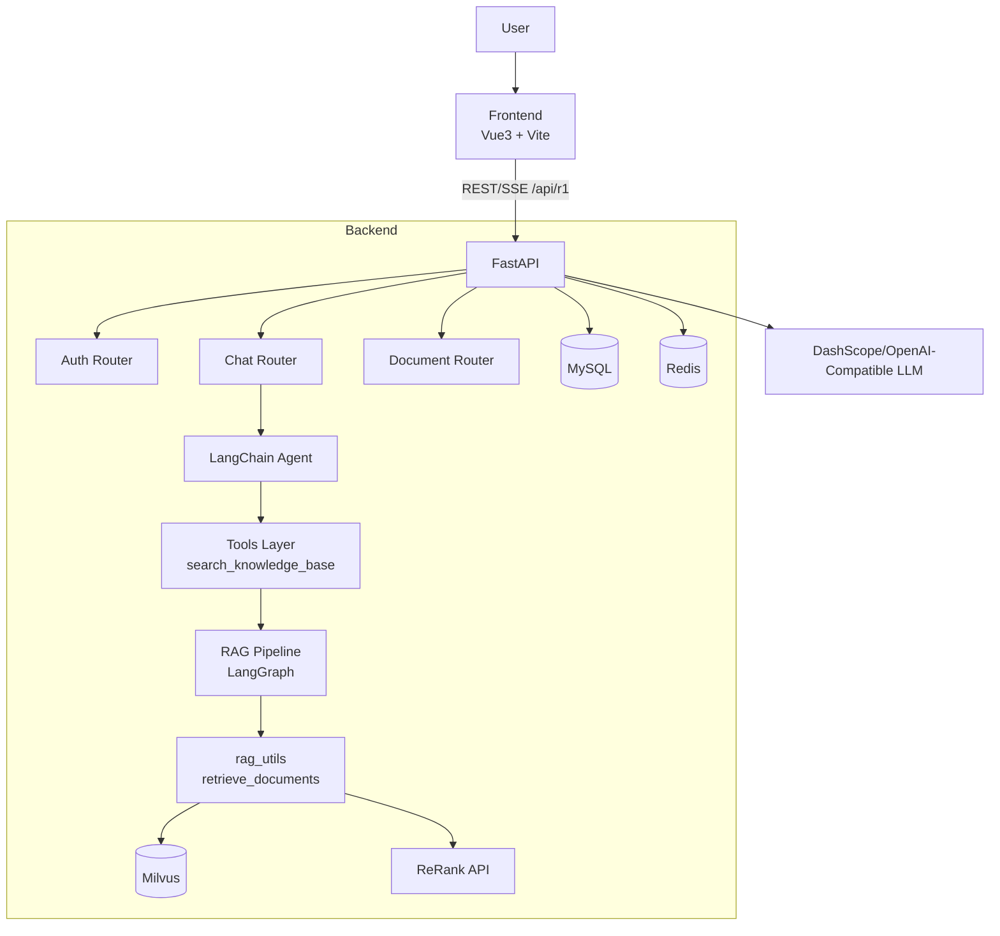
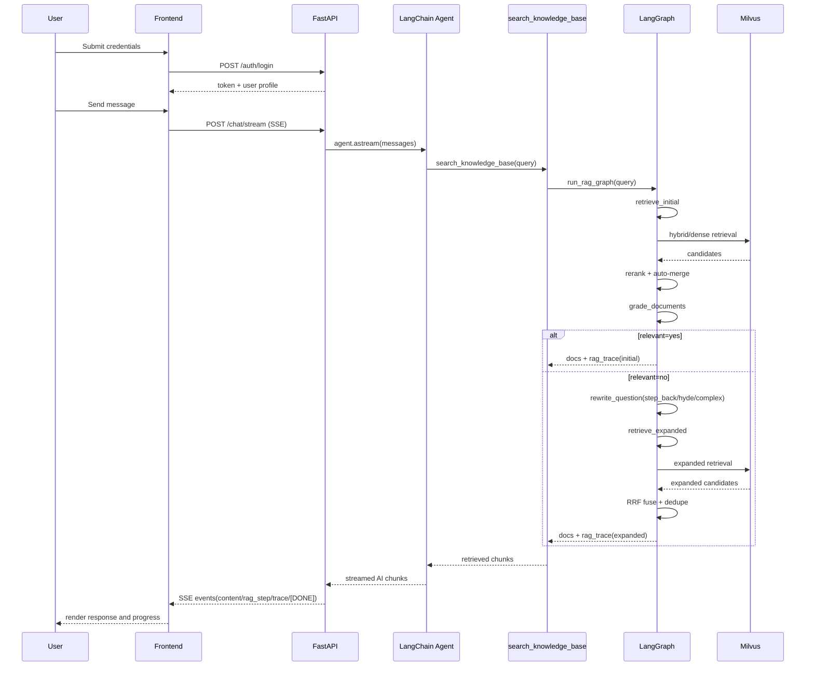

# ZhiYuan Agent

> 

## 1. Project Scope
RAG Agent 是一个前后端分离的 AI 知识问答系统，提供认证、会话、文档检索、流式回答与可观测追踪能力。

### 1.1 Goals
- 稳定提供基于知识库的问答能力（RAG）
- 支持生产可观测性（SSE 步骤、rag_trace）
- 支持可维护的工程结构（模块化前端 + 分层后端）

### 1.2 Non-Goals
- 不作为通用工作流引擎
- 不覆盖复杂多租户隔离策略（当前仓库未实现）

---

## 2. Tech Stack
### Frontend
- Vue 3
- Vite
- Vue Router
- Element Plus
- marked + highlight.js + DOMPurify

### Backend
- FastAPI
- LangChain + LangGraph
- SQLAlchemy
- MySQL
- Redis
- Milvus

---

## 3. System Architecture


### 3.1 Layer Responsibilities
- `routes/*`: HTTP 协议层、入参校验、鉴权与响应封装
- `services/*`: 业务编排层
- `tools.py`: Agent 工具暴露与上下文桥接
- `rag_pipeline.py`: LangGraph 流程编排（节点与路由）
- `rag_utils.py`: 检索算法实现（检索/重排/合并/扩展）
- `models/*` + `database.py`: 数据模型与持久化

---

## 4. Sequence Diagram (Login + Chat + RAG + SSE)


---

## 5. Retrieval Pipeline Contract
### 5.1 Entry
- Tool: `search_knowledge_base(query)`
- Pipeline Entry: `run_rag_graph(question)`

### 5.2 Core Stages
1. `retrieve_initial`
- 调用 `retrieve_documents(query, top_k=5)`
- 产出：`docs`, `context`, `rag_trace(initial)`

2. `grade_documents_node`
- 评估是否可直接回答
- 路由：`generate_answer` 或 `rewrite_question`

3. `rewrite_question_node` (conditional)
- 选择策略：`step_back | hyde | complex`
- 产出：`expanded_query` 或 `hypothetical_doc`

4. `retrieve_expanded` (conditional)
- 二次检索
- 融合：RRF + 去重
- 产出：`docs`, `context`, `rag_trace(expanded)`

### 5.3 Output
- 工具返回格式化检索片段文本
- `rag_trace` 通过 SSE `trace` 事件返回前端并落库

---

## 6. API Surface (Frontend-Used)
Base Prefix: `/api/r1`

- `POST /auth/register`
- `POST /auth/login`
- `GET /auth/me`
- `POST /chat/stream` (SSE)
- `GET /chat/sessions`
- `GET /chat/sessions/{sessionId}`
- `DELETE /chat/sessions/{sessionId}`
- `GET /documents`
- `POST /documents/upload`
- `DELETE /documents/{filename}`

### 6.1 MCP Client Layer
- Role: connect external read-only MCP servers as context sources
- Sources: `git`, `jira`, `docs`, `monitor`
- Control: source whitelist + tool-name allowlist + read-only keyword policy
- Usage: agent may call MCP tools only when Skill routing enables it

---

## 7. Project Structure
```text
Rag_Agent/
├─ backend/
│  ├─ app/
│  │  ├─ main.py
│  │  ├─ agent.py
│  │  ├─ tools.py
│  │  ├─ rag_pipeline.py
│  │  ├─ rag_utils.py
│  │  ├─ mcp/
│  │  ├─ skills/
│  │  ├─ routes/common/
│  │  ├─ services/
│  │  ├─ models/
│  │  ├─ schemas/
│  │  └─ utils/
│  ├─ requirements.txt
│  └─ docker-compose.yml
└─ frontend/
   ├─ index.html
   ├─ package.json
   ├─ vite.config.js
   └─ src/
      ├─ main.js
      ├─ App.vue
      ├─ router/index.js
      ├─ views/RagWorkspace.vue
      ├─ services/
      ├─ config.js
      ├─ state.js
      └─ style.css
```

---

## 8. Configuration
### Backend
- `ARK_API_KEY`
- `MODEL`
- `GRADE_MODEL`
- `BASE_URL`
- `RERANK_API_KEY` (optional)
- `RERANK_MODEL` (optional)
- `RERANK_BINDING_HOST` (optional)
- `MCP_ENABLED` (optional, default: false)
- `MCP_SERVERS_JSON` (optional)
- `MCP_SOURCE_ALLOWLIST` (optional)
- `MCP_TOOL_ALLOWLIST` (optional)

### Frontend
- `VITE_API_BASE_URL` (default: `/api/r1`)

---

## 9. Local Development
### 9.1 Backend
```bash
cd backend
pip install -r requirements.txt
docker compose up -d
uvicorn app.main:app --host 0.0.0.0 --port 8000 --reload
```

### 9.2 Frontend
```bash
cd frontend
npm install
npm run dev
```

### 9.3 Endpoints
- API: `http://127.0.0.1:8000`
- Swagger: `http://127.0.0.1:8000/docs`
- Frontend: `http://127.0.0.1:5173`

---

## 10. MCP Client Config
系统默认不会启用 MCP。

在 `backend/.env` 配置：
```bash
MCP_ENABLED=true
MCP_SERVERS_JSON={"github":{"transport":"streamable_http","url":"http://127.0.0.1:9001/mcp"}}
MCP_SOURCE_ALLOWLIST=git,jira,docs,monitor
MCP_TOOL_ALLOWLIST=
```

- `MCP_SERVERS_JSON` 使用 MultiServerMCPClient 的多服务配置格式。
- `MCP_SOURCE_ALLOWLIST` 控制允许接入的能力域。
- `MCP_TOOL_ALLOWLIST` 可选，用于精确白名单具体工具名。
