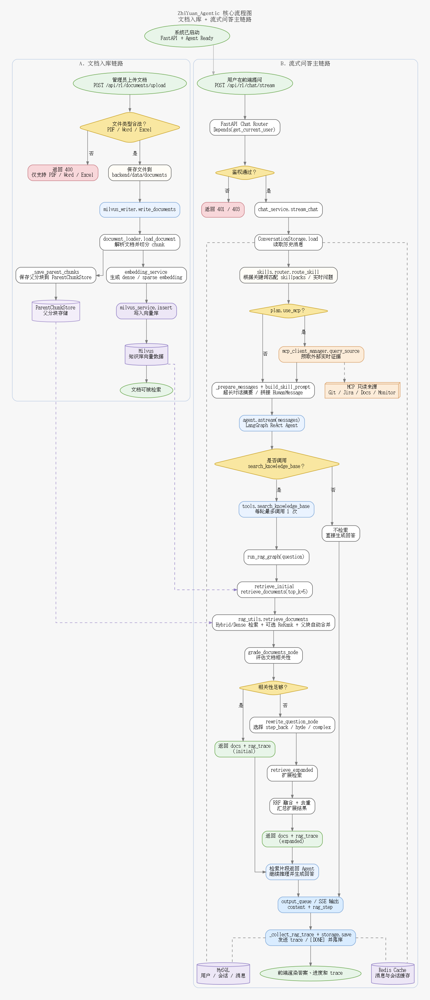
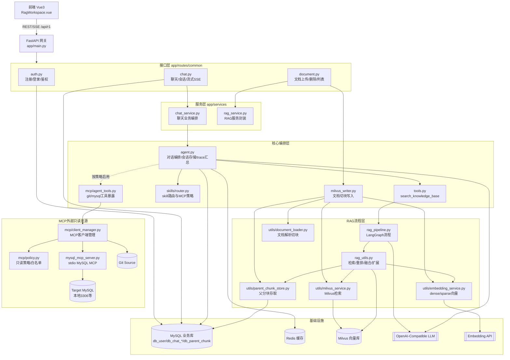

# ZhiYuan Agent（Rag_Agent）

## 项目简介
ZhiYuan Agent 是一个前后端分离的 Agentic RAG 项目，目标是提供可追踪、可落库、可流式展示的知识问答能力。系统支持用户认证、会话管理、文档上传与向量检索、SSE 流式回答、RAG Trace 展示，以及可选的 MCP 外部只读检索（`git`、`mysql`）。

## 功能特性
- 用户认证：注册、登录、JWT 鉴权、管理员权限控制
- 会话管理：会话列表、会话详情、删除会话
- 文档管理：上传 PDF/Word/Excel，自动分块并写入向量库
- RAG 检索：混合检索（dense+sparse）、可选 rerank、auto-merge、查询重写（step_back/HyDE/complex）
- Agent 对话：普通问答与 SSE 流式问答
- 可观测性：SSE 输出 `content` / `rag_step` / `trace` / `[DONE]`
- 追溯能力：消息落库时携带 `rag_trace`，可回放检索过程
- MCP 集成：支持 `git`、`mysql` 两类只读外部来源（按策略启用）

## 技术栈
### 前端
- Vue 3
- Vite
- Vue Router
- Element Plus
- marked + highlight.js + DOMPurify

### 后端
- FastAPI
- LangChain + LangGraph
- SQLAlchemy
- MySQL
- Redis
- Milvus
- MCP（FastMCP + langchain-mcp-adapters）

**流程图**



架构图




## 项目结构
```text
Rag_Agent/
├─ AGENTS.md
├─ README.md
├─ .agents/                       # 本地 agent/skill 资源
├─ .codex/
├─ backend/
│  ├─ .env
│  ├─ docker-compose.yml
│  ├─ requirements.txt
│  ├─ data/                       # 上传文档等数据目录
│  ├─ logs/
│  ├─ skillpacks/                 # skill pack 配置
│  ├─ volumes/                    # Docker 持久化目录
│  ├─ test_langsmith_eval.py
│  └─ app/
│     ├─ main.py                  # FastAPI 入口 + lifespan
│     ├─ agent.py                 # Agent 主流程（普通/流式）
│     ├─ tools.py                 # Agent 工具（search_knowledge_base 等）
│     ├─ rag_pipeline.py          # LangGraph 流程编排
│     ├─ rag_utils.py             # 检索算法实现
│     ├─ database.py              # MySQL 连接与 Session
│     ├─ config.py                # 配置与日志
│     ├─ cache.py
│     ├─ milvus_writer.py
│     ├─ routes/common/           # auth/chat/document 路由
│     ├─ services/
│     ├─ schemas/
│     ├─ models/
│     ├─ mcp/                     # MCP client/policy/tools/server
│     ├─ skills/
│     ├─ utils/
│     └─ test_api/
└─ frontend/
   ├─ .env.example
   ├─ index.html
   ├─ package.json
   ├─ package-lock.json
   ├─ vite.config.js
   └─ src/
      ├─ main.js
      ├─ App.vue
      ├─ router/index.js
      ├─ views/RagWorkspace.vue
      ├─ services/api.js
      ├─ services/markdown.js
      ├─ config.js
      ├─ state.js
      └─ style.css
```

## 环境要求
- Python 3.10+
- Node.js 18+
- npm 9+
- Docker / Docker Compose（用于依赖服务）
- 可访问的 LLM 与 Embedding 服务（OpenAI-compatible）

可选：
- ReRank 接口（若启用 `RERANK_*`）
- MCP 依赖（若启用 `MCP_ENABLED=true`）

## 安装步骤
### 1. 克隆项目
```bash
git clone <your-repo-url>
cd Rag_Agent
```

### 2. 安装后端依赖
```bash
cd backend
pip install -r requirements.txt
```

### 3. 启动依赖服务（MySQL/Redis/Milvus）
```bash
docker compose up -d
```

### 4. 启动后端
```bash
uvicorn app.main:app --host 0.0.0.0 --port 8000 --reload
```

### 5. 启动前端
```bash
cd ../frontend
npm install
npm run dev
```

## 配置说明
主要配置文件：`backend/.env`

### 一、后端业务数据库（会话/用户/消息）
- `MYSQL_HOST`
- `MYSQL_PORT`
- `MYSQL_USERNAME`
- `MYSQL_PASSWORD`
- `MYSQL_DATABASE`

> 默认代码配置常见为 `localhost:3307`（通常映射到 Docker MySQL）。

### 二、MCP 目标数据库（给 mysql MCP 查询）
- `MYSQL_MCP_HOST`
- `MYSQL_MCP_PORT`
- `MYSQL_MCP_USERNAME`
- `MYSQL_MCP_PASSWORD`
- `MYSQL_MCP_DATABASE`

> mysql MCP server 使用 `MYSQL_MCP_*`，未配置时回退 `MYSQL_*`。
> 推荐显式配置，避免“业务库”和“目标库”串线。

### 三、模型与检索配置
- `ARK_API_KEY`
- `MODEL`
- `GRADE_MODEL`
- `BASE_URL`
- `EMBEDDER`
- `AUTO_MERGE_ENABLED`
- `AUTO_MERGE_THRESHOLD`
- `LEAF_RETRIEVE_LEVEL`
- `RERANK_API_KEY`（可选）
- `RERANK_MODEL`（可选）
- `RERANK_BINDING_HOST`（可选）

### 四、MCP 配置（仅 `git`、`mysql`）
- `MCP_ENABLED=true|false`
- `MCP_SERVERS_JSON=...`
- `MCP_SOURCE_ALLOWLIST=git,mysql`
- `MCP_TOOL_ALLOWLIST=`（可选）

示例（stdio mysql MCP + git MCP）：
```bash
MCP_ENABLED=true
MCP_SERVERS_JSON={"git":{"transport":"streamable_http","url":"https://api.githubcopilot.com/mcp/","headers":{"Authorization":"Bearer ${GITHUB_PAT_TOKEN}"}},"mysql":{"transport":"stdio","command":"python","args":["-u","app/mcp/mysql_mcp_server.py"]}}
MCP_SOURCE_ALLOWLIST=git,mysql
MYSQL_MCP_HOST=127.0.0.1
MYSQL_MCP_PORT=3306
MYSQL_MCP_USERNAME=root
MYSQL_MCP_PASSWORD=123456
MYSQL_MCP_DATABASE=ai_list
```

## 使用说明
### 1. 登录与会话
1. 打开前端页面并登录。
2. 输入问题发送，系统自动创建/复用 `session_id`。
3. 可在历史面板查看与切换会话。

### 2. 端到端整体流程（详细）
1. 前端调用 `POST /api/r1/chat/stream`（SSE）。
2. FastAPI 路由完成鉴权后进入 `chat_service.stream_chat`。
3. `agent.py` 从 Redis/MySQL 读取历史消息。
4. 进行 skill 路由，确定是否启用 MCP 外部来源。
5. 初始化本轮策略：重置 MCP trace、重置工具调用守卫、绑定 rag_step 队列。
6. 构建 prompt：
   - 可选预取 MCP 外部证据（git/mysql）
   - 强制注入约束：本轮必须先调用 `search_knowledge_base`
7. Agent 开始流式推理（`agent.astream`）。
8. Agent 调用 `search_knowledge_base(query)`：
   - 单轮最多调用一次
   - 超限返回 `TOOL_CALL_LIMIT_REACHED`
9. 进入 `run_rag_graph`：
   - `retrieve_initial`：初次检索（hybrid/dense）
   - `grade_documents`：相关性判定
   - 若不足：`rewrite_question` + `retrieve_expanded`
   - 多分支结果 RRF 融合与去重
10. 检索过程通过 `rag_step` 实时推送给前端。
11. Agent 继续生成回答，后端持续发送 `content` 事件。
12. 收尾阶段汇总 `rag_trace`（含 token_usage、skill、mcp_calls），发送 `trace` 事件。
13. 最终发送 `[DONE]`。
14. 回答与 `rag_trace` 落库到 `db_chat_message`，并清理相关缓存键。

### 3. SSE 事件协议
- `content`：回答正文增量
- `rag_step`：检索/推理步骤提示
- `trace`：结构化追踪数据（含检索与 MCP 调用摘要）
- `[DONE]`：流结束标记

### 4. 文档上传与检索链路
1. 管理员上传文档。
2. 文件被解析并切块（child chunk）。
3. parent chunk 写入 MySQL `db_parent_chunk`。
4. dense/sparse 向量写入 Milvus。
5. 后续问答检索命中向量并按需 auto-merge 父分块上下文。

## API 文档
### 在线文档
- Swagger UI：`http://127.0.0.1:8000/docs`

### 主要接口
- 认证
  - `POST /api/r1/auth/register`
  - `POST /api/r1/auth/login`
  - `GET /api/r1/auth/me`
- 聊天
  - `POST /api/r1/chat`
  - `POST /api/r1/chat/stream`（SSE）
  - `GET /api/r1/chat/sessions`
  - `GET /api/r1/chat/sessions/{session_id}`
  - `DELETE /api/r1/chat/sessions/{session_id}`
- 文档
  - `GET /api/r1/documents`
  - `POST /api/r1/documents/upload`
  - `DELETE /api/r1/documents/{filename}`

## 部署方式
### 1. 本地开发部署（推荐）
- 后端本地运行
- 前端本地运行
- 依赖服务通过 Docker Compose 提供

### 2. 前后端一体部署
- 先构建前端 `npm run build`
- 将 `frontend/dist` 交给后端 `StaticFiles` 挂载
- 统一由 FastAPI 对外提供服务

### 3. 生产部署建议
- 反向代理：Nginx（处理 HTTPS 与 SSE 转发）
- 应用服务：Gunicorn + UvicornWorker（或等价方案）
- 状态服务：MySQL/Redis/Milvus 使用独立实例
- 配置与密钥：使用环境变量与密钥管理系统

## Todo
- 增加端到端自动化测试（覆盖 SSE 协议与 trace）
- 完善 MCP 集成测试（mysql/git 分源测试）
- 增加前端模块拆分（降低 `RagWorkspace.vue` 复杂度）
- 增加观测面板（请求耗时、检索耗时、MCP 调用统计）
- 完善多环境配置模板（dev/test/prod）

## 贡献方式
1. Fork 本仓库并创建功能分支。
2. 保持最小改动原则，不破坏现有分层和 SSE 协议。
3. 提交前完成基本验证：
   - 后端可启动
   - 前端可启动
   - 至少完成 1 轮 `/chat/stream` 验证
4. 提交 Pull Request，说明：
   - 修改文件
   - 变更原因
   - 是否影响 API/SSE/前端联调/RAG trace

## License
当前仓库未附带明确的 License 文件，请在使用前补充或确认授权策略。
